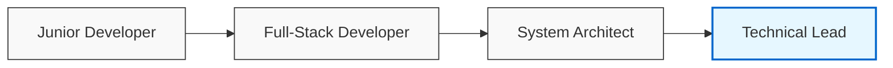

# <div align="center">👋 Hi there, I'm Sila Dennis!</div>

<div align="center">
  
  <p><em>Transforming ideas into elegant, functional solutions</em></p>
</div>

<div align="center">
  
  [](https://linkedin.com/in/siladennis77aa51264)
  [](https://github.com/SilaDennisN)
  [](mailto:dennissila1256@gmail.com)
  [](https://siladennis.dev)
  
</div>

## 💫 Who I Am

```javascript
const sila = {
  name: "Sila Dennis",
  title: "Full-Stack Developer & Problem Solver",
  location: "Nairobi, Kenya",
  expertise: ["Web Development", "Mobile Apps", "Desktop Solutions"],
  passion: "Creating technology that makes a difference in people's lives",
  strengths: ["Attention to detail", "User-centric design", "Robust architecture"],
  philosophy: "Write code today that you'll be proud of tomorrow"
};
```

I'm a versatile developer who thrives on challenges and believes in the power of technology to transform businesses. With experience across multiple platforms and languages, I specialize in creating seamless experiences that bridge technical complexity with user simplicity.

## 🚀 What I Do

<table>
  <tr>
    <td width="25%" align="center">
      
      <br/>
      <strong>Desktop Applications</strong>
      <br/>
      <small>Business automation systems with Python & PyQt5 that enhance operational efficiency</small>
    </td>
    <td width="25%" align="center">
      
      <br/>
      <strong>Web Development</strong>
      <br/>
      <small>Responsive, data-driven applications with Laravel, Spring Boot, and modern frontend frameworks</small>
    </td>
    <td width="25%" align="center">
      
      <br/>
      <strong>Mobile Solutions</strong>
      <br/>
      <small>Intuitive Android applications focused on offline-first functionality</small>
    </td>
    <td width="25%" align="center">
      
      <br/>
      <strong>System Integration</strong>
      <br/>
      <small>Connecting disparate systems through robust APIs and middleware solutions</small>
    </td>
  </tr>
</table>

## 🛠️ Tech Stack

<div align="center">

### Frontend


### Backend


### Database & Mobile


### Tools & DevOps


</div>

## 🏆 Featured Projects

<div class="projects">
  <details open>
    <summary><h3>📊 Kinaya POS System</h3></summary>
    <p>A comprehensive point-of-sale solution designed specifically for SMEs in East Africa.</p>
    <div class="project-details">
      <div class="project-image">
        
      </div>
      <div class="project-info">
        <ul>
          <li>📦 Inventory management with low-stock alerts and supplier integration</li>
          <li>💹 Real-time sales tracking with multicurrency support</li>
          <li>📊 Business intelligence dashboard with custom reporting</li>
          <li>🔄 Works online and offline with automatic synchronization</li>
          <li>🖨️ Compatible with thermal printers and barcode scanners</li>
        </ul>
        <p><strong>Technologies:</strong> Python, PyQt5, SQLite, MySQL, REST API</p>
        <a href="https://github.com/SilaDennisN/kinaya-pos" class="project-link">View Project →</a>
      </div>
    </div>
  </details>

  <details>
    <summary><h3>🏢 KejaMaster Property Management Platform</h3></summary>
    <p>A full-stack solution built to address the unique challenges of property management in urban Kenya.</p>
    <div class="project-details">
      <div class="project-image">
        
      </div>
      <div class="project-info">
        <ul>
          <li>💰 M-Pesa integration for automated rent collection and receipting</li>
          <li>📱 Tenant mobile app for service requests and communication</li>
          <li>📊 Landlord dashboard with occupancy analytics and financial reports</li>
          <li>🔧 Maintenance tracking with vendor management system</li>
          <li>📝 Digital lease agreements with e-signature support</li>
        </ul>
        <p><strong>Technologies:</strong> Laravel, Vue.js, MySQL, Firebase, REST API</p>
        <a href="https://github.com/SilaDennisN/kejamaster" class="project-link">View Project →</a>
      </div>
    </div>
  </details>

  <details>
    <summary><h3>📱 BiasharaMobile Field Agent App</h3></summary>
    <p>An Android application that empowers field sales representatives with offline-first capabilities.</p>
    <div class="project-details">
      <div class="project-image">
        
      </div>
      <div class="project-info">
        <ul>
          <li>🗺️ Geolocation tracking with optimized route planning</li>
          <li>📸 Product catalog with offline image caching</li>
          <li>📊 Real-time sales performance analytics</li>
          <li>🔄 Efficient data synchronization in low-bandwidth environments</li>
          <li>🧾 Digital order processing with signature capture</li>
        </ul>
        <p><strong>Technologies:</strong> Java, Android SDK, SQLite, Retrofit, Google Maps API</p>
        <a href="https://github.com/SilaDennisN/biashara-mobile" class="project-link">View Project →</a>
      </div>
    </div>
  </details>
</div>

## 📊 My Impact

<div class="impact-metrics">
  <div class="metric">
    <h3>15+</h3>
    <p>Projects Delivered</p>
  </div>
  <div class="metric">
    <h3>20+</h3>
    <p>Satisfied Clients</p>
  </div>
  <div class="metric">
    <h3>5+</h3>
    <p>Years Experience</p>
  </div>
  <div class="metric">
    <h3>3</h3>
    <p>Countries Served</p>
  </div>
</div>

## 📈 GitHub Stats

<div align="center">
  
  
</div>

## 🌱 Current Focus

I'm currently expanding my expertise in:

- ☁️ Cloud-native application architecture with AWS and Azure
- 🔒 Implementing robust security practices for financial applications
- 📱 Progressive Web Apps for cross-platform compatibility
- 🤖 Integrating AI for business process optimization
- 📊 Data visualization techniques for complex business analytics

## 💼 Professional Journey



## 🎓 Education & Certifications

- **BSc in Computer Science** - University of Nairobi
- **AWS Certified Solutions Architect**
- **Google Associate Android Developer**
- **Laravel Certified Developer**

## 📚 Blog & Knowledge Sharing

I regularly write about my experiences and insights on [dev.to/siladennis](https://dev.to/siladennis). Recent articles:

- [Building Offline-First Applications for Challenging Network Environments](https://dev.to/siladennis)
- [Integrating Mobile Money Solutions for African E-commerce](https://dev.to/siladennis)
- [Performance Optimization Techniques for Laravel Applications](https://dev.to/siladennis)

<div align="center">
  
  ## 💬 Let's Connect
  
  <p>I'm always open to discussing new projects, innovative ideas, or opportunities to be part of your vision.</p>
  
  [](https://www.buymeacoffee.com/siladennis)
  [](https://wa.me/254712345678)
  [](https://calendly.com/siladennis)
  
  ⭐ **Feel free to star my repositories if you find them useful!** ⭐
  
</div>

<div align="center">
  
</div>

<!-- Custom CSS -->
<style>
.projects {
  animation: fadeIn 1s ease-in-out;
}

.project-details {
  display: flex;
  flex-wrap: wrap;
  gap: 20px;
  margin-top: 15px;
}

.project-image {
  flex: 1;
  min-width: 300px;
  border-radius: 8px;
  overflow: hidden;
  box-shadow: 0 4px 8px rgba(0,0,0,0.1);
  transition: transform 0.3s ease;
}

.project-image:hover {
  transform: scale(1.02);
}

.project-info {
  flex: 2;
  min-width: 300px;
}

.project-link {
  display: inline-block;
  margin-top: 10px;
  padding: 8px 16px;
  background-color: #0366d6;
  color: white;
  text-decoration: none;
  border-radius: 4px;
  font-weight: bold;
  transition: background-color 0.3s ease;
}

.project-link:hover {
  background-color: #0056b3;
}

.impact-metrics {
  display: flex;
  justify-content: space-around;
  flex-wrap: wrap;
  margin: 30px 0;
  text-align: center;
}

.metric {
  padding: 20px;
  margin: 10px;
  background-color: #f6f8fa;
  border-radius: 8px;
  min-width: 120px;
  box-shadow: 0 2px 5px rgba(0,0,0,0.05);
  transition: transform 0.3s ease, box-shadow 0.3s ease;
}

.metric:hover {
  transform: translateY(-5px);
  box-shadow: 0 5px 15px rgba(0,0,0,0.1);
}

.metric h3 {
  font-size: 2rem;
  margin: 0;
  color: #0366d6;
}

@keyframes fadeIn {
  from { opacity: 0; transform: translateY(20px); }
  to { opacity: 1; transform: translateY(0); }
}
</style>
